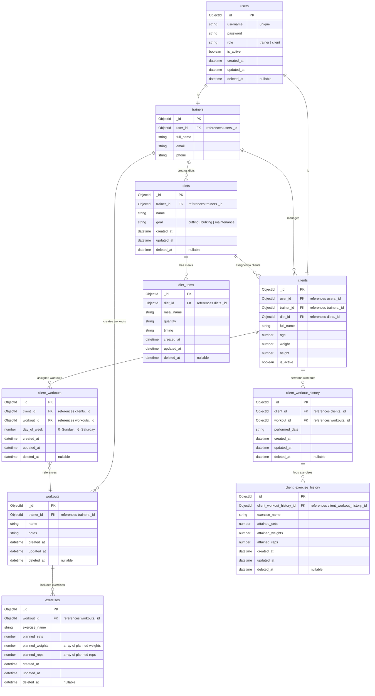

# Entity Relationship Diagram

Below is the ER diagram for the Fitness App architecture.



# Database Schemas

Below are all the Mongoose schemas used in the Fitness App backend.

---

## User Schema

```js
const mongoose = require("mongoose");

const userSchema = new mongoose.Schema({
  username: { type: String, unique: true, required: true },
  password: { type: String, required: true },
  role: { type: String, enum: ["trainer", "client"], required: true },
  is_active: { type: Boolean, default: true },
  created_at: { type: Date, default: Date.now },
  updated_at: { type: Date },
  deleted_at: { type: Date, default: null },
});

module.exports = mongoose.model("User", userSchema);
```
## Trainer Schema
```js
const trainerSchema = new mongoose.Schema({
  user_id: { type: mongoose.Schema.Types.ObjectId, ref: "User", required: true },
  full_name: String,
  email: String,
  phone: String,
});

module.exports = mongoose.model("Trainer", trainerSchema);
```
## Client Schema
```js
const clientSchema = new mongoose.Schema({
  user_id: { type: mongoose.Schema.Types.ObjectId, ref: "User", required: true },
  trainer_id: { type: mongoose.Schema.Types.ObjectId, ref: "Trainer", required: true },
  diet_id: { type: mongoose.Schema.Types.ObjectId, ref: "Diets" },
  full_name: String,
  age: Number,
  weight: Number,
  height: Number,
  is_active: { type: Boolean, default: true },
});

module.exports = mongoose.model("Client", clientSchema);
```

## Workout Schema
```js
const workoutSchema = new mongoose.Schema({
  trainer_id: { type: mongoose.Schema.Types.ObjectId, ref: "Trainer", required: true },
  name: { type: String, required: true },
  notes: String,
  created_at: { type: Date, default: Date.now },
  updated_at: { type: Date, default: Date.now },
  deleted_at: { type: Date, default: null }
});

module.exports = mongoose.model("Workout", workoutSchema);
```
# Exercise Schema
```js
const exerciseSchema = new mongoose.Schema({
  workout_id: { type: mongoose.Schema.Types.ObjectId, ref: "Workout", required: true },
  exercise_name: { type: String, required: true },
  planned_sets: Number,
  planned_weights: [Number],
  planned_reps: [Number],
  created_at: { type: Date, default: Date.now },
  updated_at: { type: Date, default: Date.now },
  deleted_at: { type: Date, default: null }
});

module.exports = mongoose.model("Exercise", exerciseSchema);
```


## Diets Schema
```js
const dietSchema = new mongoose.Schema({
  trainer_id: { type: mongoose.Schema.Types.ObjectId, ref: "Trainer", required: true },
  name: String,
  goal: { type: String, enum: ["cutting", "bulking", "maintenance"] },
  created_at: { type: Date, default: Date.now },
  updated_at: { type: Date },
  deleted_at: { type: Date, default: null },
});

module.exports = mongoose.model("Diet", dietSchema);
```

## Diet Item Schema
```js
const dietSchema = new mongoose.Schema({
  trainer_id: { type: mongoose.Schema.Types.ObjectId, ref: "Trainer", required: true },
  name: String,
  goal: { type: String, enum: ["cutting", "bulking", "maintenance"] },
  created_at: { type: Date, default: Date.now },
  updated_at: { type: Date },
  deleted_at: { type: Date, default: null },
});

module.exports = mongoose.model("Diet", dietSchema);
```

## Client Workout Schema
```js
const clientWorkoutSchema = new mongoose.Schema({
  client_id: { type: mongoose.Schema.Types.ObjectId, ref: "Client", required: true },
  workout_id: { type: mongoose.Schema.Types.ObjectId, ref: "Workout", required: true },
  day_of_week: { type: Number, min: 0, max: 6 },
  created_at: { type: Date, default: Date.now },
  updated_at: { type: Date, default: Date.now },
  deleted_at: { type: Date, default: null }
});

module.exports = mongoose.model("ClientWorkout", clientWorkoutSchema);
```

## Client Workout History Schema

```js
const clientWorkoutHistorySchema = new mongoose.Schema({
  client_id: { type: mongoose.Schema.Types.ObjectId, ref: "Client", required: true },
  workout_id: { type: mongoose.Schema.Types.ObjectId, ref: "Workout", required: true },
  performed_date: String,
  created_at: { type: Date, default: Date.now },
  updated_at: { type: Date, default: Date.now },
  deleted_at: { type: Date, default: null }
});

module.exports = mongoose.model("ClientWorkoutHistory", clientWorkoutHistorySchema);
```

## Client Exercise History Schema
```js
const clientExerciseHistorySchema = new mongoose.Schema({
  client_workout_history_id: { type: mongoose.Schema.Types.ObjectId, ref: "ClientWorkoutHistory", required: true },
  exercise_name: String,
  attained_sets: Number,
  attained_weights: [Number],
  attained_reps: [Number],
  created_at: { type: Date, default: Date.now },
  updated_at: { type: Date, default: Date.now },
  deleted_at: { type: Date, default: null }
});

module.exports = mongoose.model("ClientExerciseHistory", clientExerciseHistorySchema);
```


