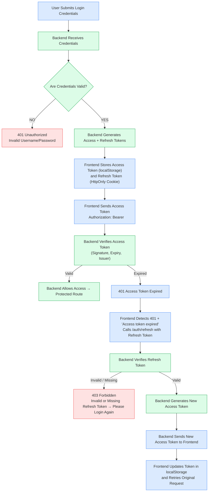
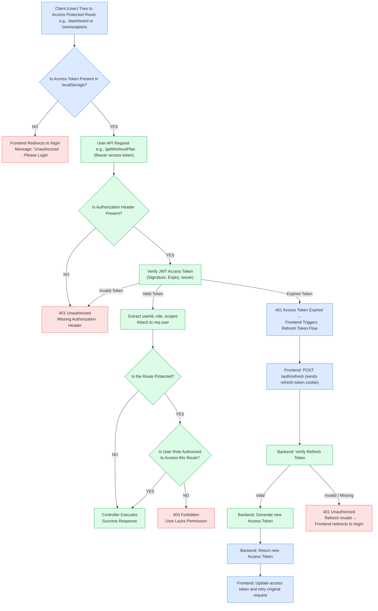
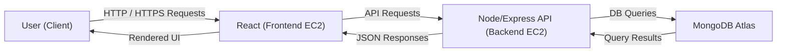

<h1>System Architecture</h1>

## Overview
This system follows a modern, cloud-based full-stack architecture built for scalability, flexibility, and security.
Each part of the application — the frontend interface, backend services, and database — works independently but connects seamlessly through secure REST APIs and automated CI/CD pipelines. 

- **Frontend**: React.js (v19.2.0)  
- **Backend**: Node.js (v20 LTS) + Express (v4.19) with **JWT-based authentication**  
- **Email Service**: Nodemailer (v6.9) for transactional and notification emails  
- **Cloud Hosting**: AWS EC2 instances for both frontend and backend deployment  
- **Database**: MongoDB Atlas (v7.0) – fully managed NoSQL database  
- **Repositories**: Separate GitHub repositories for frontend and backend codebases  
- **CI/CD Pipeline**: Automated builds and deployments via **GitHub Actions**  

---

## Development Workflow

 
<h3><b>Frontend Repository</b></h3>
<ul>
  <li>Developed using <b>React.js</b></li>
  <li>Code changes are pushed to <b>GitHub</b></li>
  <li>Each commit triggers an automated <b>GitHub Actions</b> workflow</li>
  <li>GitHub Actions builds and deploys the frontend to the <b>AWS EC2</b> instance</li>
</ul>

<h3><b>Backend Repository</b></h3>
<ul>
  <li>Developed using <b>Node.js + Express</b></li>
  <li>Implements <b>JWT-based authentication</b> for secure access</li>
  <li>Code pushed to <b>GitHub</b> triggers GitHub Actions</li>
  <li>GitHub Actions automatically builds, tests, and deploys the backend to <b>AWS EC2</b></li>
</ul>

---

## Deployment Architecture

<h3><b>Frontend EC2 (React.js)</b></h3>
<ul>
  <li>Serves the production build (HTML, CSS, JS) built with React.js</li>
  <li>Receives HTTP requests from user browsers</li>
  <li>Makes API calls to the Backend EC2 instance</li>
  <li>Receives API responses from the backend</li>
  <li>Renders the final UI and sends HTTP responses</li>
  <li>Update automatically via <b>GitHub Actions</b> CI/CD pipeline</li>
</ul>

<h3><b>Backend EC2 (Node + Express)</b></h3>
<ul>
  <li>Handles all API endpoints and routes</li>
  <li>Verifies <b>JWT tokens</b> for authentication</li>
  <li>Implements <b>Role-Based Protected Routes</b> — only authorized users can access restricted APIs</li>
  <li>Processes API requests and interacts with MongoDB Atlas</li>
  <li>Update and managed via <b>GitHub Actions</b> CI/CD</li>
</ul>

<h3><b>MongoDB Atlas</b></h3>
<ul>
  <li>Cloud-hosted NoSQL database</li>
  <li>Stores all user, workout, and authentication data</li>
  <li>Accessible only to the backend through secure connection strings</li>
  <li>Ensures data consistency and redundancy</li>
</ul>

---

## User Interaction Flow
1. User opens the application in a browser  
2. Browser sends HTTP request → Frontend EC2  
3. The browser loads and displays the React app.
4. React sends API requests → Backend EC2  

---
## System Communication Flow

<h3><b>Frontend → Backend Communication</b></h3>
<ul>
  <li>React sends API requests to the backend</li>
  <li>Backend processes and returns <b>JSON responses</b></li>
  <li>React updates the UI based on the response</li>
</ul>

<h3><b>Backend → Database Communication</b></h3>
<ul>
  <li>Backend API sends queries to <b>MongoDB Atlas</b></li>
  <li>Atlas returns data to the backend</li>
  <li>Backend processes data and sends it to the frontend</li>
</ul>

---

## System Workflow Summary
- Developer commits code → GitHub  
- GitHub Action trigger and deploy code to EC2  
- User → Browser → Frontend EC2  
- Frontend → Backend EC2 (API)  
- Backend → MongoDB Atlas  
- Backend → Frontend response  
- UI Appers
---

## Authentication (JWT Flow)

---

## Authorization (Role-Based Access Control)

---

# Data Flow Diagrams (DFD)

Below are the complete DFDs for the system (Level 0 and Level 1).  

---

## DFD – Level 0 (Context Diagram)

---

## DFD – Level 1 (Authentication + Protected Endpoints)

{ width=1300 }

---

