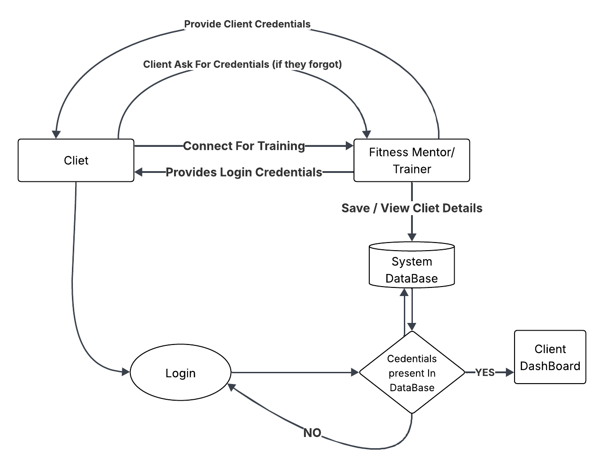

## Client Onboarding Process:

Before using the application, the journey typically begins when a **client** approaches a **mentor/trainer** through social media, a phone call, or any other communication channel seeking fitness guidance.

Once both agree to start, the **mentor** creates a new account for the client by generating a **unique username and password**.  
These credentials are shared with the client, who can then **log in** to the system and access their personalized dashboard.

If the client ever forgets their credentials, the mentor has full authority to verify and provide the login details again.

{ width=700 }

This setup ensures:
- A controlled onboarding process (mentor-approved accounts only)  
- Secure access for each client  
- Easy recovery for lost credentials

# Trainer Functionalities:

## 1. Client Management

- **Add new client** with a username and password.   
- **View all clients** with full info – their profile, assigned workouts,login credentials and past workouts.
- **Delete client** if they stop mentorship.  

---

## 2. Create, Assign & Manage Templates

Templates are **structured schedules** for both workouts and diet plans.  
They help trainers maintain consistency, save time, and ensure every client follows a personalized plan suited to their goals.

### How it works
When a new client joins without workout or diet knowledge, the trainer usually starts with a **beginner-level template**.  
As the client progresses or introduces new requirements (like muscle gain, fat loss, or injury recovery), the trainer can **update or switch** them to a different template — ensuring the plan always aligns with their fitness stage.

### Functionalities
- **Create:** Build workout or diet templates based on daily or monthly routines of client.  
- **Assign:** Apply a template to one or multiple clients simultaneously.  
- **Edit:** Modify exercises, meal items, or schedules whenever needed.  
- **Remove Client:** Detach a specific client from a template.  
- **Delete:** Remove unnecessary templates to keep the system clean.

### Training Templates:
#### 1. Workout Template  
**Used for:** Strength exercises  
- **Strength exercises:** These involve lifting weights and are used to build muscle.  

**Includes:**  
- Exercise name  
- Number of Sets  
- Suggested weight  
- Reps  

**Example:**  

| Exercise Name  | Sets / Duration | Suggested Weight | Reps Range |
|----------------|------------------|------------------|-------------|
| Bench Press    | 3 sets           | 20kg / 25kg / 30kg | 10 / 8 / 6 |
| Squats         | 4 sets           | 40kg / 45kg / 50kg | 12 / 10 / 8 |
| Shoulder Press | 3 sets           | 15kg / 20kg / 25kg | 10 / 10 / 8 |

#### 2. Diet Template

**Used for:** Planning meals and timings.  

**Includes:**  
- Food item  
- Quantity  
- Time  

**Example:**

| Food Item | Quantity | Time |
|------------|-----------|-------|
| Oats | 1 Bowl | 6:00 AM |
| Banana | 1 Piece | 6:00 AM |
| Brown Rice | 1 Plate | 9:00 AM |
| Paneer | 100g | 12:30 PM |
| Salad | 1 Bowl | 12:30 PM |
| Oats | 1 Bowl | 7:00 PM |
| Milk | 1 Glass | 7:00 PM |

---

## 3. Report Handling

- Trainers get daily progress reports of the assigned schedule from clients via email.  
- Trainers can also receive reports for past workout sessions of the client if the client forgot to send them or wasn't able to send them on time.

